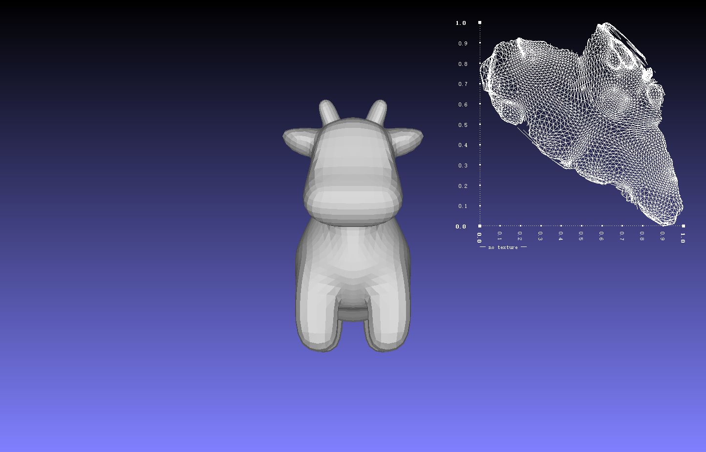

# UV Seam Inference via Barycentric Consistency Analysis



## What We Do

Compared to the original pipeline, which directly consumes per-vertex UV predictions produced by FAM, we introduce a **face-aware UV refinement and seam recovery procedure**.

Concretely, we:

1. **Augment the mesh with auxiliary samples** (face barycenters and edge-midpoint interpolations).
2. **Query the UV prediction network on this enriched point set**.
3. **Detect inconsistencies between predicted UVs and linear interpolation assumptions within each triangle**.
4. **Interpret these inconsistencies as implicit UV seams**.
5. **Resolve seams by duplicating UV vertices (per-corner UVs) and adjusting face-UV indices**, while keeping the original geometric mesh unchanged.

This transforms the original per-vertex UV output into a **piecewise continuous, seam-aware UV parameterization**, suitable for standard OBJ-style per-corner UV representations.

## Assumptions Behind This Design

Our method relies on the following assumptions:

1. **Local linearity assumption (in the absence of seams).**
   If a triangle is not cut by a UV seam, the UV mapping inside the triangle should be approximately linear.
   In particular:

   * The UV of the face barycenter should match the average of the three vertex UVs.
   * The UV of an interpolated midpoint between a vertex and the barycenter should match linear interpolation in UV space.

2. **Seam manifests as interpolation inconsistency.**
   When a UV seam passes through a triangle, per-vertex UVs alone are insufficient to represent the mapping.
   This typically causes:

   * Orientation flips (negative UV area),
   * Or noticeable deviations between predicted UVs at interpolated samples and their linearly expected positions.

3. **The network implicitly encodes seam information.**
   Although FAM outputs only a single UV per vertex, we assume that its predictions at nearby auxiliary points (barycenter and interpolated samples) encode enough information to infer whether a seam exists locally.

4. **Seams can be resolved via UV duplication without modifying geometry.**
   We assume seams can be handled purely in UV space by introducing new UV vertices (per-corner UVs), without changing vertex positions or face connectivity.

## Detailed Pipeline Description

### 1. Mesh Augmentation with Face-Centered Samples

Given a triangular mesh with vertices ( V ) and faces ( F ), we enrich the input point set by introducing two types of auxiliary samples per face:

* **Face barycenter points**

  $$
  \mathbf{p}_c = \frac{1}{3} (\mathbf{p}_0 + \mathbf{p}_1 + \mathbf{p}_2)
  $$

* **Interpolated edge–barycenter points**
  
  For each vertex $ \mathbf{p}_k $ of a face:
  $$
  \mathbf{p}_{i,k} = \frac{1}{2}(\mathbf{p}_k + \mathbf{p}_c)
  $$

Normals are generated analogously and normalized. These auxiliary points are appended to the original vertex list.

---

### 2. UV Prediction on the Augmented Point Set

We feed the augmented point set into the original FAM inference pipeline:

```python
vtx_uv_image_list, vtx_uv, vtx_edge, vtx_checker_colors = test_fam(...)
```

This yields predicted UV coordinates for:

* original vertices,
* face barycenters,
* interpolated auxiliary points.

Importantly, **no changes are made to the network architecture or weights**.

---

### 3. UV Normalization

All predicted UVs are normalized into a unit square via min–max normalization to ensure numerical stability and consistent thresholds for later comparisons.

---

### 4. Face-Level Consistency Analysis

For each face, we extract:

* vertex UVs,
* barycenter UV $ \mathbf{u}_c $,
* three interpolated UVs $ \mathbf{u}_{i,0}, \mathbf{u}_{i,1}, \mathbf{u}_{i,2} $.

We perform two consistency checks:

1. **Orientation check**
   The signed area of the UV triangle is computed. A negative or unstable orientation indicates a potential seam or fold.

2. **Interpolation consistency check**
   For each vertex ( k ), we compare:

   $$
   \frac{\mathbf{u}_c + \mathbf{u}_k}{2} \quad \text{vs.} \quad \mathbf{u}_{i,k}
   $$

   Deviations beyond a threshold ($ \varepsilon \cdot \beta $) are treated as seam indicators.

---

### 5. Seam Localization and UV Duplication

When a seam is detected on a face:

* We selectively **replace the UV index of the affected vertex** with a newly created UV entry.
* The new UV is estimated either:

  * by extrapolating from the barycenter towards the interpolated UV, or
  * by duplicating the barycenter UV, depending on proximity ($ \gamma $ threshold).

This effectively converts a single per-vertex UV into **multiple per-corner UVs**, resolving discontinuities while preserving mesh topology.

---

### 6. Output Construction (OBJ with Per-Corner UVs)

Finally, we:

* concatenate original and newly generated UVs,
* update face UV indices accordingly,
* export the mesh in standard OBJ format using:

  ```
  v / vt / vn
  ```

The resulting file supports explicit seams and is compatible with conventional DCC tools and renderers.

## Comparison to the Original Method

**Original pipeline:**

* Uses FAM to predict **one UV per vertex**.
* Directly exports the result without seam reasoning.
* Cannot represent UV discontinuities within a triangle.

**Our extended pipeline:**

* Preserves the original FAM inference.
* Infers seam presence via auxiliary point predictions.
* Converts implicit seams into explicit per-corner UVs.
* Produces a valid, seam-aware UV parameterization.
